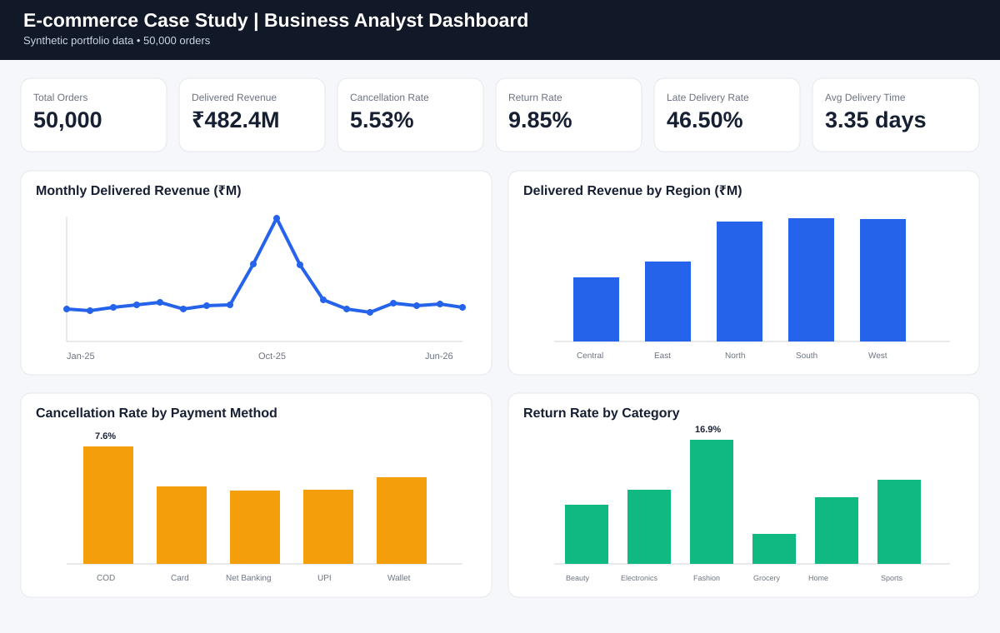

# E-commerce Case Study

This is an **independent Business Analyst portfolio project** I created to practice end-to-end business analysis on an e-commerce order-to-delivery process.

I used a fictional company called **NovaCart** and a synthetic dataset of **50,000 orders** covering January 2025 to June 2026. My goal was to understand why cancellations, late deliveries, and returns were happening and then turn those findings into practical business and system requirements.

## Dashboard Preview



The interactive dashboard is available in [`dashboard/index.html`](dashboard/index.html). It includes revenue, cancellation, return, delivery, region, category, payment-method and monthly performance views.

## What I worked on

For this case study, I covered the full BA workflow instead of only building a dashboard.

- Defined the business problem, project scope, stakeholders, and KPIs
- Created AS-IS and TO-BE process flows
- Wrote BRD and FRD documents
- Created user stories, acceptance criteria, UAT scenarios, and an RTM
- Built a relational SQL data model
- Wrote 25 SQL queries to answer business questions
- Built an interactive dashboard for operational and commercial KPIs
- Documented findings and recommendations

## Business problem

NovaCart is growing, but the order fulfillment process has three major issues:

1. Some orders are getting cancelled before delivery.
2. A large share of deliveries are reaching customers later than promised.
3. Returns and refunds are reducing revenue and affecting customer experience.

I focused on the **Order → Fulfillment → Shipment → Delivery → Return** journey to understand where the biggest gaps were.

## Main KPIs I tracked

- Total Orders: **50,000**
- Delivered Revenue: **₹482,375,079**
- Cancellation Rate: **5.53%**
- Return Rate: **9.85%**
- Late Delivery Rate: **46.50%**
- Average Delivery Time: **3.35 days**
- Refund Value: **₹37,310,977**

## Key findings from my analysis

A few patterns stood out when I analyzed the data:

- COD orders had a cancellation rate of around **7.6%**, which was higher than UPI orders at around **4.9%**.
- Cross-region fulfillment had a much higher late-delivery rate than same-region fulfillment.
- Fashion had the highest return rate in the dataset.
- Delivery performance became weaker during higher-volume festive months.

These findings helped me decide which process improvements should be prioritized.

## Recommendations I proposed

Based on the analysis, I proposed the following improvements:

- Prefer same-region warehouse fulfillment when inventory is available
- Validate inventory before final order confirmation
- Add a reconfirmation step for selected COD orders
- Track courier SLA performance by route and region
- Use return reasons as feedback for product and fulfillment improvements
- Provide operations teams with an exception-focused KPI dashboard

## Tools used

**SQL / SQLite** — data model and business analysis queries  
**HTML / JavaScript** — interactive dashboard  
**Business Analysis** — BRD, FRD, process mapping, user stories, acceptance criteria, UAT, RTM, KPI definitions

## Repository structure

```text
sql/schema.sql              Database schema
sql/analysis_queries.sql    25 SQL business-analysis queries
dashboard/index.html        Interactive dashboard
dashboard/dashboard-preview.svg Dashboard preview shown above
docs/BRD.md                 Business Requirements Document
docs/FRD.md                 Functional Requirements Document
docs/user_stories.md        User stories and acceptance criteria
docs/UAT.md                 UAT scenarios
docs/RTM.md                 Requirements Traceability Matrix
docs/process_maps.md        AS-IS / TO-BE process maps
docs/data_dictionary.md     Data dictionary
docs/interview_story.md     Notes for explaining the project
resume_bullets.md           Resume-ready project bullets
```

## What I learned from this project

This project helped me understand how a Business Analyst connects data analysis with process improvement. The SQL analysis was useful for identifying the problem, but the more important part was translating those findings into requirements, process changes, user stories, and test scenarios.

It also helped me practice explaining why a metric matters instead of only reporting the number.

## Important note

This is a **portfolio case study using synthetic data**. NovaCart is fictional, and this project should be presented as an independent project rather than professional work experience.