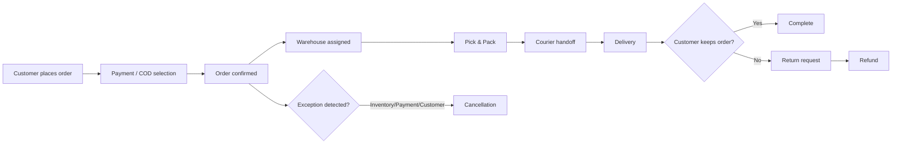

# Process Maps

## AS-IS

### AS-IS weaknesses
- Warehouse choice is not sufficiently optimized around region/service level.
- COD risk is treated like prepaid orders.
- SLA monitoring is reactive.
- Return data is not systematically fed back into operational decisions.

## TO-BE

```mermaid
flowchart LR
A[Customer places order] --> B[Inventory & serviceability validation]
B --> C{Payment type}
C -- Prepaid --> D[Confirm order]
C -- COD --> E{Risk / reconfirmation needed?}
E -- Yes --> F[Customer reconfirmation]
E -- No --> D
F --> D
D --> G[Select best warehouse]
G --> H{Same-region inventory available?}
H -- Yes --> I[Local warehouse]
H -- No --> J[Cross-region with reason code]
I --> K[Pick & Pack]
J --> K
K --> L[Courier assignment using SLA score]
L --> M[Delivery monitoring]
M --> N{Late-risk exception?}
N -- Yes --> O[Operations alert]
N -- No --> P[Delivery]
O --> P
P --> Q{Return?}
Q -- No --> R[Complete]
Q -- Yes --> S[Capture return reason]
S --> T[Refund + root-cause feedback]
```

